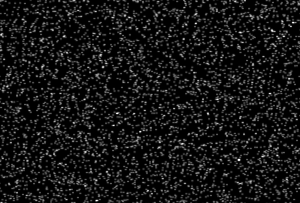

# DiffPointRasterisation

*Differentiable rasterisation of point clouds in julia*

[](https://github.com/microscopic-image-analysis/DiffPointRasterisation.jl/actions/workflows/CI.yml?query=branch%3Amain)
 [](https://microscopic-image-analysis.github.io/DiffPointRasterisation.jl/dev)



## About

This package provides a rasterisation routine for arbitrary-dimensional point cloud data that is fully (auto-)differentiable.
The implementation uses multiple threads on CPU or GPU hardware if available.

The roots of this package are in single-particle 3d reconstruction from tomographic data, and as such it comes with the following ins and out:

- Currently only a single "channel" (e.g gray scale) is supported
- If data is projected to a lower dimension (meaning the dimensionality of the output grid is lower than the dimensionality of the points)
  - Projections are always orthographic (currently no support for perspective projection)
  - no "z-blending": The contribution of each point to its output voxel is independent
    of the point's coordinate along the projection axis.

## Rasterisation interface

The interface consists of a single function `raster` that accepts a point cloud (as a vector of m-dimensional vectors) and pose/projection parameters, (as well as optional weight and background parameters) and returns a n-dimensional (n <= m) array into which the points are rasterized, each point by default with a weight of 1 that is mulit-linearly interpolated into the neighboring grid cells.

#### Simple Example

```julia-repl
julia> using DiffPointRasterisation, LinearAlgebra

julia> grid_size = (5, 5)  # 2d grid with 5 x 5 pixels
(5, 5)

julia> rotation, translation = I(2), zeros(2)  # pose parameters
(Bool[1 0; 0 1], [0.0, 0.0])
```

```julia-repl
julia> raster(grid_size, [zeros(2)], rotation, translation)  # single point at center
5×5 Matrix{Float64}:
 0.0  0.0  0.0  0.0  0.0
 0.0  0.0  0.0  0.0  0.0
 0.0  0.0  1.0  0.0  0.0
 0.0  0.0  0.0  0.0  0.0
 0.0  0.0  0.0  0.0  0.0
```

```julia-repl
julia> raster(grid_size, [[0.2, 0.0]], rotation, translation)  # single point half a pixel below center
5×5 Matrix{Float64}:
 0.0  0.0  0.0  0.0  0.0
 0.0  0.0  0.0  0.0  0.0
 0.0  0.0  0.5  0.0  0.0
 0.0  0.0  0.5  0.0  0.0
 0.0  0.0  0.0  0.0  0.0
```

```julia-repl
julia> raster(grid_size, [[0.2, -0.2]], I(2), zeros(2))  # single point half a pixel below and left of center
5×5 Matrix{Float64}:
 0.0  0.0   0.0   0.0  0.0
 0.0  0.0   0.0   0.0  0.0
 0.0  0.25  0.25  0.0  0.0
 0.0  0.25  0.25  0.0  0.0
 0.0  0.0   0.0   0.0  0.0
```

## Differentiability

Both, an explicit function that calculates derivatives of `raster`, as well as an integration to common automatic differentiation libraries in julia are provided.

### Automatic differentiation libraries

This package provides rules for reverse-mode automatic differentiation libraries that are based on the [ChainRules.jl](https://juliadiff.org/ChainRulesCore.jl/dev/#ChainRules-roll-out-status) ecosystem. So using `raster(args...)` in a program that uses any of the ChainRules-based reverse-mode autodiff libraries should just work™. Gradients with respect to all parameters (except `grid_size`) are supported:

#### Example using Zygote.jl

we define a simple scalar "loss" that we want to differentiate:
```julia-repl
julia> using Zygote

julia> target_image = rand(grid_size...)
5×5 Matrix{Float64}:
 0.345889  0.032283  0.589178   0.0625972  0.310929
 0.404836  0.573265  0.350633   0.0417926  0.895955
 0.174528  0.127555  0.0906833  0.639844   0.832502
 0.189836  0.360597  0.243664   0.825484   0.667319
 0.672631  0.520593  0.341701   0.101026   0.182172

julia> loss(params...) = sum((target_image .- raster(grid_size, params...)).^2)
loss (generic function with 1 method)
```

some input parameters to `raster`:

```julia-repl
julia> points = [2 * rand(2) .- 1 for _ in 1:5]  # 5 random points
5-element Vector{Vector{Float64}}:
 [0.8457397177007744, 0.3482756109584688]
 [-0.6028188536164718, -0.612801322279686]
 [-0.47141692007256464, 0.6098964840013308]
 [-0.74526926786903, 0.6480225109030409]
 [-0.4044384373422192, -0.13171854413805173]

julia> rotation = [  # explicit matrix for rotation (to satisfy Zygote)
           1.0 0.0
           0.0 1.0
       ]
2×2 Matrix{Float64}:
 1.0  0.0
 0.0  1.0
```
and let Zygote calculate the gradient of `loss` with respect to those parameters

```julia-repl
julia> d_points, d_rotation, d_translation = Zygote.gradient(loss, points, rotation, translation);

ulia> d_points
5-element Vector{StaticArraysCore.SVector{2, Float64}}:
 [-2.7703628931165025, 3.973371400200988]
 [-0.70462225282373, 1.0317734946448016]
 [-1.7117138793471494, -3.235178706903591]
 [-2.0683933141077886, -0.6732149105779637]
 [2.6278388385655904, 1.585621066861592]

julia> d_rotation
2×2 reshape(::StaticArraysCore.SMatrix{2, 2, Float64, 4}, 2, 2) with eltype Float64:
 -0.632605  -3.26353
  4.12402   -1.86668

julia> d_translation
2-element StaticArraysCore.SVector{2, Float64} with indices SOneTo(2):
 -4.62725350082958
  2.6823723442258274
```

### Explicit interface

The explicit interface for calculating derivatives of `raster` with respect to its arguments again consists of a single function called `raster_pullback!`:

The function `raster_pullback!(ds_dout, raster_args...)` takes as input the sensitivity of some scalar quantity to the output of `raster(grid_size, raster_args...)`, `ds_dout`, and returns the sensitivity of said quantity to the *input arguments* `raster_args` of `raster` (hence the name pullback).

#### Example

We can repeat the above calculation using the explicit interface.
To do that, we first have to calculate the sensitivity of the scalar output of `loss` to the output of `raster`. This could be done using an autodiff library, but here we do it manually:

```julia-repl
julia> ds_dout = 2 .* (target_image .- raster(grid_size, points, rotation, translation))  # gradient of loss \w respect to output of raster
5×5 Matrix{Float64}:
 0.152276  -0.417335   1.16347   -0.700428  -0.63595
 0.285167   0.033845  -0.625258  -0.801198   0.760124
 0.349055   0.25511    0.181367   1.27969    1.665
 0.379672   0.721194   0.487329   1.65097    1.33464
 1.34526    1.04119    0.454354  -1.3402     0.364343
```

Then we can feed that into `raster_pullback!` together with the same arguments that were fed to `raster`:

```julia-repl
julia> ds_din = raster_pullback!(ds_dout, points, rotation, translation);
```

We see that the result is the same as obtained via Zygote:

```julia-repl
julia> ds_din.points
2×5 Matrix{Float64}:
  2.77036   0.704622  1.71171  2.06839   -2.62784
 -3.97337  -1.03177   3.23518  0.673215  -1.58562

julia> ds_din.rotation
2×2 StaticArraysCore.SMatrix{2, 2, Float64, 4} with indices SOneTo(2)×SOneTo(2):
  0.632605  3.26353
 -4.12402   1.86668

julia> ds_din.translation
2-element StaticArraysCore.SVector{2, Float64} with indices SOneTo(2):
  4.62725350082958
 -2.6823723442258274
```